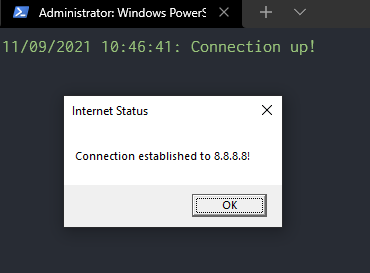

# How To Add Powershell Functions to Function Drive

> Source: [How Do I Use a Windows PowerShell Script Containing Functions?](https://devblogs.microsoft.com/scripting/how-do-i-use-a-windows-powershell-script-containing-functions/)
>
> Script: [Test-InternetConnection.ps1](scripts/Test-InternetConnection.ps1)

```ps
PS C:\> C:\scripts\pwsh\Test-InternetConnection.ps1
PS C:\> dir function:\test-internet*
```

Calling the script like so above returns nothing when we request the function using the `dir` alias. But if we [DOT source the function](https://www.truesec.com/hub/blog/powershell-dot-sourcing) and then ask for it from the function drive:

```ps
PS C:\> . C:\scripts\pwsh\Test-InternetConnection.ps1
PS C:\> dir function:\test-internet*
```

We get the following output:

```
CommandType     Name                                     Version    Source
-----------     ----                                     -------    ------
Function        Test-InternetConnection
```

We can then call this function from global scope, for the duration of the Powershell session:

```ps
Test-InternetConnection -Site 8.8.8.8 -Wait 2
```

Result:



---

[Back to Main](../README.md)
